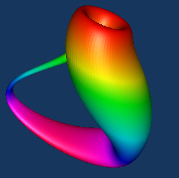
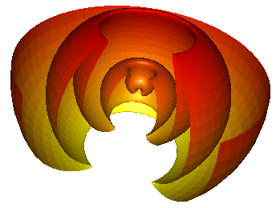
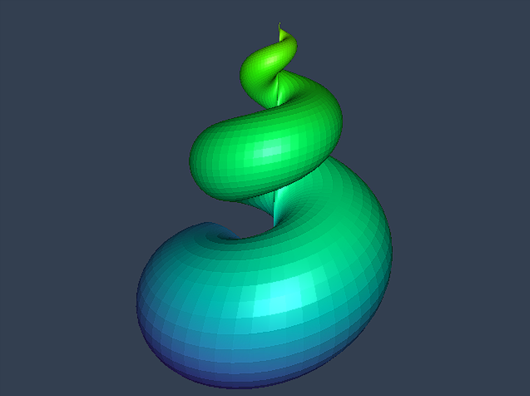
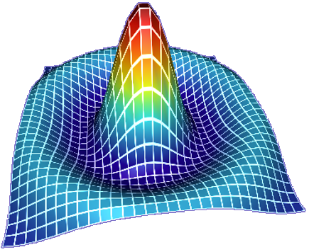
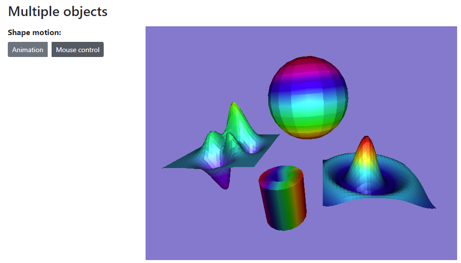
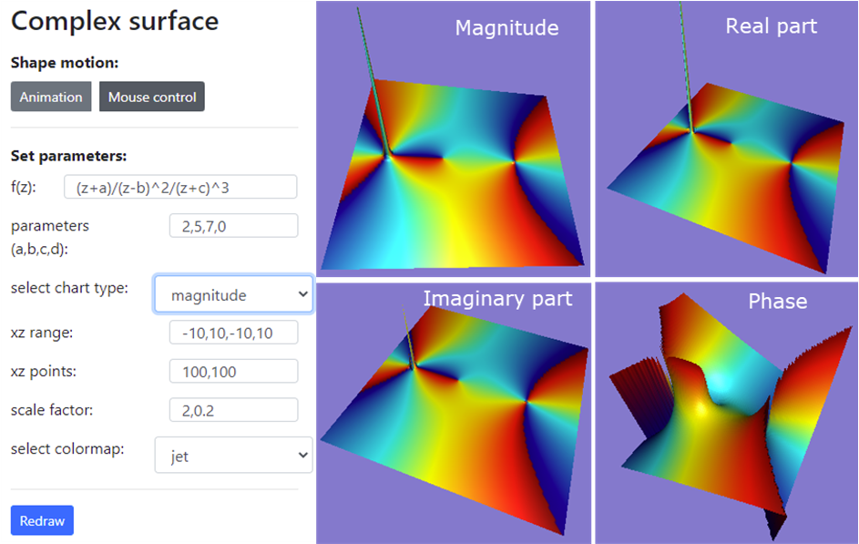

# WebGPU Graphics Programming: Step-by-Step 

WebGPU is the next-generation graphics API and future web standard for graphics and compute, aiming to provide modern 3D graphics and 
computation capabilities with the GPU acceleration. To help you be familiar with this new graphics API and able to build your WebGPU 
applications, I will create a YouTube video series about WebGPU programming and discuss an easy-to-follow WebGPU application in each video episode. 
This repository contains all the code examples used in the YouTube video series.

The YouTube video series uses the real-world sample apps to explain the WebGPU basics, shader program, GPU buffer, and rendering pipeline. From this video series, you will learn how to create primitives and simple objects in WebGPU. As you gradually progress through the video series, you will get to grips with advanced WebGPU topics, including 3D transformation, lighting calculation, colormaps, and textures. At the same time, you will learn how to create advanced 3D WebGPU objects, including various 3D wireframes, 3D shapes, simple and parametric 3D surfaces with 
colormaps and textures, as well as 3D surface plots and fractal graphics described by complex functions. In addition, you will explore new WebGPU features, such as compute shader and storage buffer, and how to use them to simulate large particle systems.

By the end of this video series, you will have the skill you need to build your own GPU-accelerated graphics and computing on the web with the WebGPU API. 

Most examples used in this video series are taken from my recently published book "Practical WebGPU Graphics". Please see details at https://drxudotnet.com or https://book.gincker.com. 

## YouTube Video Links (upload a new video on every Thursday):

Please visit my YouTube channel: [Practical Programming with Dr. Xu](https://www.youtube.com/channel/UCg14XfqXim0vpgabU3T7tRg)

### Video Series for WebGPU Step-by-Step:

1. Set up Development Environment: https://youtu.be/-hXtt4ioH5A  
2. Create First Triangle: https://youtu.be/QWh968pmsbg
3. Create Triangle with different Vertex Colors: https://youtu.be/h6Dqos4mfVY
4. Create a Triangle with GLSL Shaders: https://youtu.be/vmqx7rJk4uU
5. Create Point and Line Primitives: https://youtu.be/q8_uD9EMVRg
6. Create Triangle Primitives: https://youtu.be/1JMHg8BgWTY
7. Create a Colorful Square with GPU Buffer: https://youtu.be/L4k5Glv0gSM
8. Create a Colorful Square with a Single GPU Buffer: https://youtu.be/G5j5EMfHQR0
9. Create a Colorful Square with an Index GPU Buffer: https://youtu.be/Y1zUZhA8vv8
10. Create a 3D Cube with Distinct Face Colors: https://youtu.be/Ewy1QdFBLVc
11. 3D Cube Animation and Camera Control: https://youtu.be/Tbor4MHGN_I
12. 3D Cube with Distinct Vertex Colors: https://youtu.be/cU0gzGgjDS4 
13. Create a 3D Sphere Wireframe: https://youtu.be/9E_tSiybdMw
14. Create a 3D Cylinder Wireframe: https://youtu.be/hhTcmMfyGQ4
15. Create a 3D Cone Wireframe: https://youtu.be/RyowA2ytRYo
16. Create a 3D Torus Wireframe: https://youtu.be/njKt4tY0QjA
17. Implement Light Model: https://youtu.be/KCqqpXQiWcY 
### Code Update Videos

1. Code Update 1: https://youtu.be/pfWVH2uaerw
2. Code Update 2: https://youtu.be/yTkGXYlIjEw
3. Code Update 3: https://youtu.be/NJ-Dr0eeTaU
4. Code Update 4: https://youtu.be/1Ydti6_-aB4
## Building

This repository organizes all samples with the git submodules. The sample apps are built with TypeScript and bundled using WebPack. Building the apps requires an installation of Node.js.

The following steps shows how to run the sample apps:

* Carefully watch the first video ( **https://youtu.be/-hXtt4ioH5A** ) to set up correct development environment. 
* Click on the link for the sample app that you are interested.
* Clone or download it to your local machine.
* Install dependencies with the command: **npm install**.
* Compile and bundle the app with the command: **npm run dev**, **npm run prod**, or **npm run watch**.
* Run the live-server from VS-Code and then navigate to **http://localhost:5500** or **http://127.0.0.1:5500** to view the app.

## Sample Objects 
Here are some sample objects created using the WebGPU API, which I will discussed in my video series.

### Klein Bottle Created Using WebGPU:

### Wellenkugel Surface Created Using WebGPU:  
 

### Snail Shell Created Using WebGPU:

### Sievert-Enneper Surface Created Using WebGPU:

### Breather Surface Created Using WebGPU:

### 3D Sinc Surface created using WebGPU:
 

### Multiple-Textures Created Using WebGPU:
 

### Multiple Objects on a Scene created using WebGPU:
 

### 3D Surface Plots for Complex Functions created using WebGPU:
 

<!--### Another Surface Plot for Complex Function:
 -->

## License

The MIT License (MIT).

Copyright (c) 2021 Jack Xu.

Permission is hereby granted, free of charge, to any person obtaining a copy of this software and associated documentation files (the "Software"), to deal in the Software without restriction, including without limitation the rights to use, copy, modify, merge, publish, distribute, sublicense, and/or sell copies of the Software, and to permit persons to whom the Software is furnished to do so, subject to the following conditions:

The above copyright notice and this permission notice shall be included in all copies or substantial portions of the Software.

THE SOFTWARE IS PROVIDED "AS IS", WITHOUT WARRANTY OF ANY KIND, EXPRESS OR IMPLIED, INCLUDING BUT NOT LIMITED TO THE WARRANTIES OF MERCHANTABILITY, FITNESS FOR A PARTICULAR PURPOSE AND NONINFRINGEMENT. IN NO EVENT SHALL THE AUTHORS OR COPYRIGHT HOLDERS BE LIABLE FOR ANY CLAIM, DAMAGES OR OTHER LIABILITY, WHETHER IN AN ACTION OF CONTRACT, TORT OR OTHERWISE, ARISING FROM, OUT OF OR IN CONNECTION WITH THE SOFTWARE OR THE USE OR OTHER DEALINGS IN THE SOFTWARE.
 
